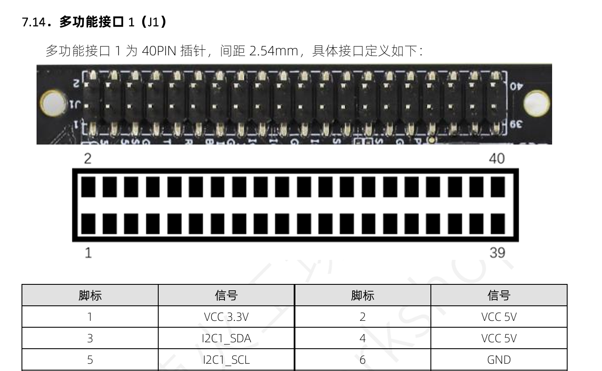

# README

## 编辑说明

这个文件是按照最简单的库文件（functions）、头文件（headers）、main文件来写的，具体就是库文件实现功能，头文件来声明，main文件使用封装好的库函数实现程序。

function文件夹里面的api.cpp文件不用改，这个是厂商给的封装好的库。

function文件夹里面的i2c_driver是之后又改的，用的时候出现问题了可以进一步看一眼。

function里面的pseudo_color.cpp是用来做伪彩色映射的，这个也是我写的，出现问题了注意看一下旁边注释以及相关的逻辑来进行更改。

header文件夹里面的文件都是随着上面function文件夹的文件变动而变动的，这个很简单不在赘述。

然后编译的话这个模块不打，就直接写的makefile文件放开发板上编译就好，不能直接在你电脑上面编译然后给.exe文件放上去，这样开发板无法运行

如果依赖的functions、headers中的文件名称或者数量有所改变，再或者头文件里的依赖项有所改变，记得改这个makefile文件

使用方法的话，看下面，下面是之前整理发老师的时候写的：

## 文件树结构

```
├── get_heat                                     # 热成像处理模块
│   ├── functions                                # 热成像功能实现源码
│   │   ├── MLX90640_API.cpp                     # MLX90640红外传感器API接口实现
│   │   ├── MLX90640_I2C_Driver.cpp              # I2C通信驱动实现
│   │   ├── pseudo_color.cpp                     # 温度数据伪彩色图像转换逻辑
│   ├── headers                                  # 头文件目录
│   │   ├── MLX90640_API.h                       # 红外传感器API声明
│   │   ├── MLX90640_I2C_Driver.h                # I2C驱动函数声明
│   │   └── pseudo_color.h                       # 伪彩色转换函数声明
│   ├── main.cpp                                 # 热成像模块主程序
│   ├── main.o                                   # 主程序编译目标文件
│   ├── makefile                                 # 编译规则文件
│   └── mlx_app                                  # 热成像应用程序可执行文件
```

## 项目介绍

#### 热成像（get_heat）

系统利用MLX90640红外传感器实现热成像。利用迈来芯官方所给固件库进行在飞腾派上的移植，同时在通过红外传感器获取温度数据后使用插值算法与伪彩色转换，将其转化为温度矩阵和热像图并显示在屏幕上，为无人机预警提供依据。

## 使用方法

#### 热成像（get_heat）

##### 接入mlx90640传感器

这个传感器是I2C的，用到开发板上是多功能接口1（J1）的1、3、5、6脚标



##### 编译运行

依赖库：`opencv`等，具体看makefile文件。

编译：`make`

或者如果按照上述插头插入也可直接：`./mlx_app`

